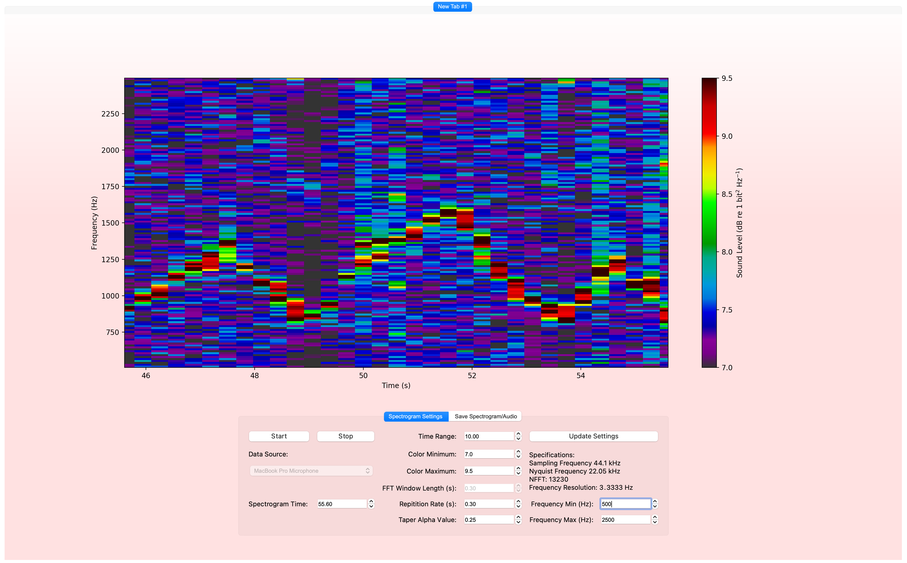
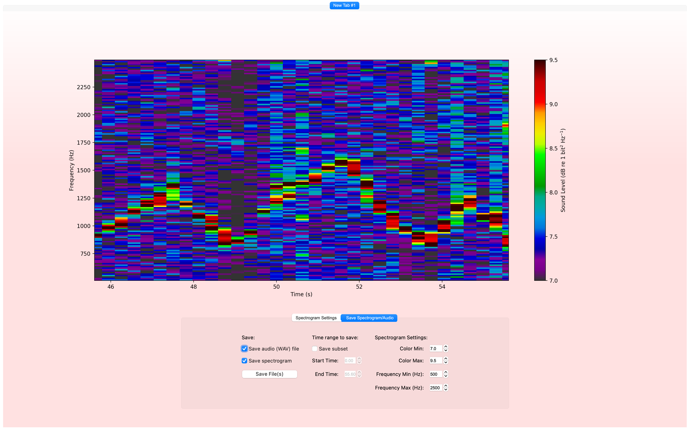

This is a Python-based spectrogram that runs with PyQt5, Matplotlib, and PyAudio. Users can either view a spectrogram in realtime using audio from their computer's microphone device(s) or replay audio from .WAV files. Required modules can be installed with `pip install -r requirements.txt`.

PyRealtimeSpectrogram allows users to control basic spectrogram plot characteristics such as the axes limits and color range on the plot, as well as some signal processing parameters to include the repetition rate, window length, and alpha value for a simple Tukey taper to reduce spectral leakage projecting onto the spectrogram.

Users can also save the recorded audio and spectrogram, either including the entire spectrogram period or a specific subset.

Future improvements if I come back to this side project:
* Universal settings (e.g. GUI refresh rate)
* Advanced control over FFT parameters and filtering
* Post-recording filtering to remove unwanted signals from the audio (high/low-pass filtering, regenerating audio from a subset of the spectrogram)

